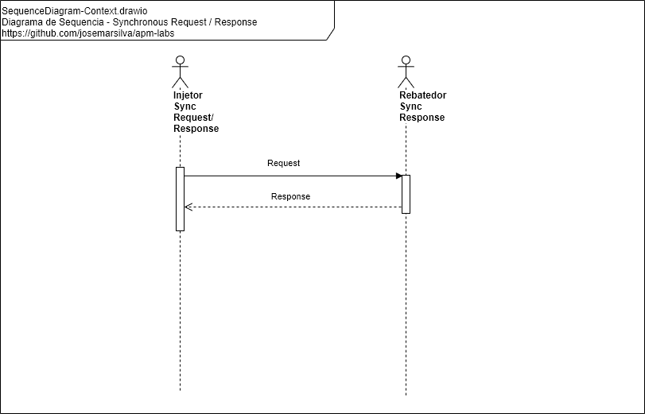
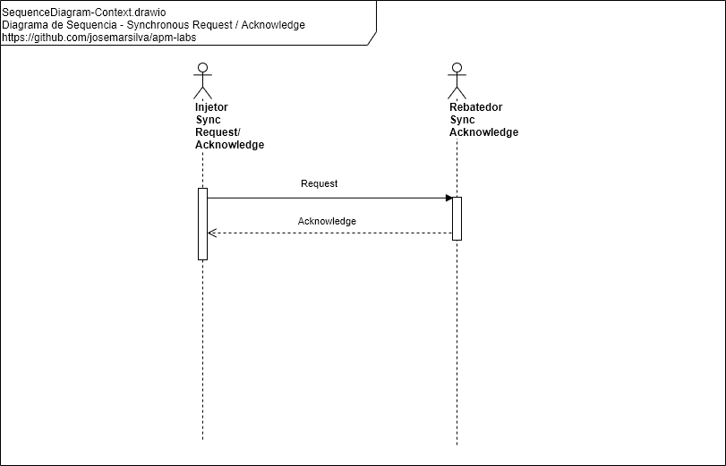
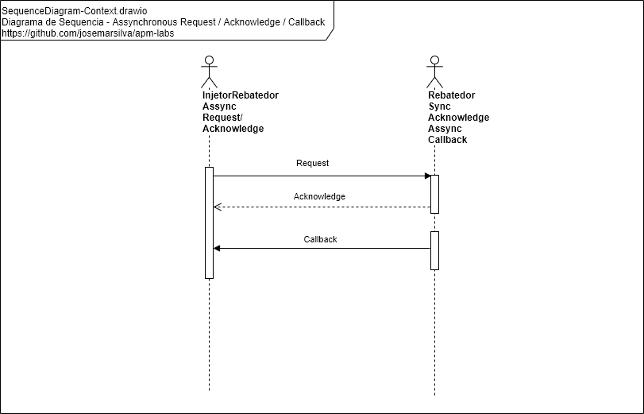

## README-design-patterns-standard-conventions-and-best-practices

### [3. Projeto](./README.md#3-projeto)

### 3.5. Design Patterns, Standard, Conventions and Best Practices

#### 3.5.1. Diagrama de Sequencia - Synchronous Request / Response

 

#### 3.5.2. Diagrama de Sequencia - Synchronous Request / Acknowledge

 

#### 3.5.3. Diagrama de Sequencia - Synchronous Request / Acknowledge / Poll

#### 3.5.4. Diagrama de Sequencia - Synchronous Request / Acknowledge / Callback

#### 3.5.5. Diagrama de Sequencia - Synchronous Request / Acknowledge / Relay / Pool

#### 3.5.6. Diagrama de Sequencia - Synchronous Request / Acknowledge / Relay / Callback

