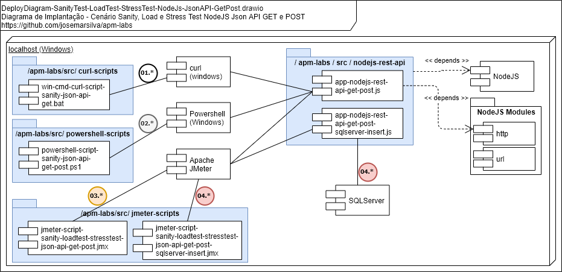
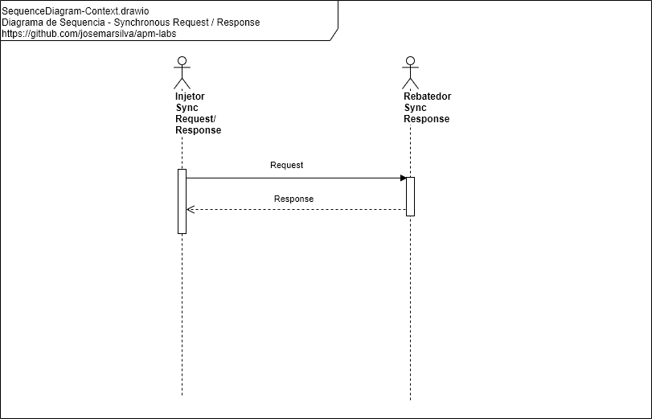

## README-guia-exec-demo-teste-sanity-loadtest-stresstest-json-api-get-post.md

[## 3. Projeto](./README.md#3-projeto)

[### 3.4. Guia de Execução, Demonstração e Cenários de Teste](./README.md#34-guia-de-execução-demonstração-e-cenários-de-teste)

#### 3.4.2. Performance Test - Teste de Sanidade, Carga e Estresse com Json API's GET e POST

##### Planejar

* **Objetivo**: O objetivo deste cenário de testes é avaliar se uma <ins>API</ins> construída em <ins>NodeJS</ins> com um cadastro simples consegue suportar uma carga de 10 a 100 usuários simultâneos fazendo requisições de GET e POST. Para completar, desejamos estressar aplicação até saber qual o limite de usuários simultâneos.
* **Tipo de Testes**: *Teste de Carga (Load Test)* e *Teste de Estresse (Stress Test)*
* **Ciclos e Cenários**: Executar um único ciclo para cada cenário com cada uma das ferramentas

| Cenário | Detalhamento |
| :------ | :---         |
| **01**  | *Teste de Sanidade (Sanity Test)* da aplicação com scripts `Curl(windows)`, acessando REST API, somente GET, somente 100 _requests_ e no _Design Patterns: Synchronous Request / Response_ |
| **02**  | *Teste de Sanidade (Sanity Test)* e *Teste de Carga (Load Test)* da aplicação com scripts `Powershell(windows)`, acessando REST API, com variações: GET/POST, com variações de quantidades (conforme detalhamento do item) e no _Design Patterns: Synchronous Request / Response_ |
| **03**  | *Teste de Carga (Load Test)* da aplicação com scripts `JMeter`, acessando REST API, com variações: GET/POST, com variações de quantidades e usuários simultâneos (conforme detalhamento do item) e no _Design Patterns: Synchronous Request / Response_ |


* **Quantidades, rampa de subida, tempo e usuários simultâneos**:

| Quantidade _(qty)_       | Rampa _(ramp-up)_ | Tempo _(dur)_ | Usuários _(threads)_ | Obs  |
| ---:                     | :---:             | :---:         | :---                 | :--- |
| 1, 100 e 1000 _requests_ | n/a               | n/a           | Cenários com 1, 10 e 100  _threads_ simultâneas | n/a  |


* **Amostra da carga "payload" e "test-data"**:
  * *Payload* do `POST` request:

```json
{
    "id":  1,
    "name":  "Name 1",
    "salary":  1
}
```


* **Infraestrutura, arquitetura e sequência**:
  * Infraestrutura:
    * Intel Core i5-8250U CPU @ 1.60 GHz 1.80 GHz - RAM 16 GB - Windows 10 Pro
  * Arquitetura:
 
  * Sequência:

 


* **Monitoramento**: n/a

* **Construção robôs de testes: injetar, rebater e monitorar**:
  * Os robôs de teste para _injetar_:
    * *Curl* scripts:
      * ( `win-cmd-curl-script-sanity-json-api-get.bat` ) construídos e disponíveis em `./src/curl-scripts`
    * *Powershell* scripts:
      * ( `powershell-script-sanity-json-api-get-post.ps1` ) construídos e disponíveis em `./src/powershell-scripts`
    * *JMeter* scripts:
      * ( `jmeter-script-` ) construídos e disponíveis em `./src/jmeter-scripts`
  * Os robôs de teste para _rebater_:
    * ( `nodejs-rest-api-get-post.js`) construídos e disponíveis em `./src/nodejs-rest-api`
  * Os robôs de teste para _monitorar_:
    * n/a

* **Itens de análise, check-list e relatórios**: Quadro comparativo das características de cada ferramenta, facilidades, dificuldades, etc

##### Executar

###### Cenário-01

* *Iniciar* o(s) _rebatedor_ servidor REST API `nodejs-rest-api-get-post.js` disponível(eis) em `src\nodejs-rest-api`

```cmd
apm-labs> cd src/nodejs-rest-api
nodejs-webserver> node nodejs-rest-api-get-post.js
```

* *Executar* os *Teste de Sanidade (Sanit Test)* do `Cenário-01`:
  * Execute o(s) _injetor_ REST GET Request `win-cmd-curl-script-sanity-json-api-get.bat` disponível(eis) em `src\curl-scripts`
  * Obtenha e encontre a diferença de tempo entre data/hora final e inicial em segundos e divida pela quantidade
  * Pronto! Você encontrou a *métrica* de *TPS - Transações por Segundos* deste cenário

* *Encerrar* o(s) _rebatedor_ servidor REST API `nodejs-rest-api-get-post.js`. Use ^C na tela do Windows Command onde ele está sendo executado

###### Cenário-02

* *Iniciar* o(s) _rebatedor_ servidor REST API `nodejs-rest-api-get-post.js` disponível(eis) em `src\nodejs-rest-api`

```cmd
apm-labs> cd src/nodejs-rest-api
nodejs-webserver> node nodejs-rest-api-get-post.js
```

* *Executar* um *Teste de Carga (Load Test)* do `Cenário-02`:
  * Execute o(s) _injetor_ REST GET/POST Request `powershell -file powershell-script-sanity-json-api-get-post.ps1` disponível(eis) em `src\powershell-scripts`
  * Obtenha e encontre a diferença de tempo entre data/hora final e inicial em segundos e divida pela quantidade
  * Pronto! Você encontrou a *métrica* de *TPS - Transações por Segundos* deste cenário

* *Encerrar* o(s) _rebatedor_ servidor REST API `nodejs-rest-api-get-post.js`. Use ^C na tela do Windows Command onde ele está sendo executado

###### Cenário-02.b

* *Iniciar* o(s) _rebatedor_ servidor REST API `nodejs-rest-api-get-post.js` disponível(eis) em `src\nodejs-rest-api`

```cmd
apm-labs> cd src/nodejs-rest-api
nodejs-webserver> node nodejs-rest-api-get-post.js
```

* *Executar* um *Teste de Carga (Load Test)* do `Cenário-02.b`:
  * Execute o(s) _injetor_ REST GET/POST Request `powershell -file powershell-script-sanity-json-api-get-post.ps1 -qty 100` disponível(eis) em `src\powershell-scripts`
  * Obtenha e encontre a diferença de tempo entre data/hora final e inicial em segundos e divida pela quantidade
  * Pronto! Você encontrou a *métrica* de *TPS - Transações por Segundos* deste cenário

* *Encerrar* o(s) _rebatedor_ servidor REST API `nodejs-rest-api-get-post.js`. Use ^C na tela do Windows Command onde ele está sendo executado

###### Cenário-02.c

* *Iniciar* o(s) _rebatedor_ servidor REST API `nodejs-rest-api-get-post.js` disponível(eis) em `src\nodejs-rest-api`

```cmd
apm-labs> cd src/nodejs-rest-api
nodejs-webserver> node nodejs-rest-api-get-post.js
```

* *Executar* um *Teste de Carga (Load Test)* do `Cenário-02.c`:
  * Execute o(s) _injetor_ REST GET/POST Request `powershell -file powershell-script-sanity-json-api-get-post.ps1 -qty 1000` disponível(eis) em `src\powershell-scripts`
  * Obtenha e encontre a diferença de tempo entre data/hora final e inicial em segundos e divida pela quantidade
  * Pronto! Você encontrou a *métrica* de *TPS - Transações por Segundos* deste cenário

* *Encerrar* o(s) _rebatedor_ servidor REST API `nodejs-rest-api-get-post.js`. Use ^C na tela do Windows Command onde ele está sendo executado

###### Cenário-03

* *Iniciar* o(s) _rebatedor_ servidor REST API `nodejs-rest-api-get-post.js` disponível(eis) em `src\nodejs-rest-api`

```cmd
apm-labs> cd src/nodejs-rest-api
nodejs-webserver> node nodejs-rest-api-get-post.js
```

* *Executar* um *Teste de Carga (Load Test)* do `Cenário-03`:
  * Execute o(s) _injetor_ REST GET/POST Request `jmeter-script-sanity-loadtest-stresstest-json-api-get-post.jmx` disponível(eis) em `src\powershell-scripts` com a seguinte configuração de `Thread Group`
    * Number of Threads(users): `1`
    * Loop Count: `100`
  * Utilize a planilha `jmeter-script-plans-and-results-beautifier.xlsx` para compilar as métricas de _elapsed time_ e _tps_ e gerar imagens padronizadas de gráficos de planos e resultados.

* *Encerrar* o(s) _rebatedor_ servidor REST API `nodejs-rest-api-get-post.js`. Use ^C na tela do Windows Command onde ele está sendo executado

###### Cenário-03.b

* *Iniciar* o(s) _rebatedor_ servidor REST API `nodejs-rest-api-get-post.js` disponível(eis) em `src\nodejs-rest-api`

```cmd
apm-labs> cd src/nodejs-rest-api
nodejs-webserver> node nodejs-rest-api-get-post.js
```

* *Executar* um *Teste de Carga (Load Test)* do `Cenário-03.b`:
  * Execute o(s) _injetor_ REST GET/POST Request `jmeter-script-sanity-loadtest-stresstest-json-api-get-post.jmx` disponível(eis) em `src\powershell-scripts` com a seguinte configuração de `Thread Group`
    * Number of Threads(users): `1`
    * Loop Count: `1000`
  * Utilize a planilha `jmeter-script-plans-and-results-beautifier.xlsx` para compilar as métricas de _elapsed time_ e _tps_ e gerar imagens padronizadas de gráficos de planos e resultados.

* *Encerrar* o(s) _rebatedor_ servidor REST API `nodejs-rest-api-get-post.js`. Use ^C na tela do Windows Command onde ele está sendo executado

###### Cenário-03.c

* *Iniciar* o(s) _rebatedor_ servidor REST API `nodejs-rest-api-get-post.js` disponível(eis) em `src\nodejs-rest-api`

```cmd
apm-labs> cd src/nodejs-rest-api
nodejs-webserver> node nodejs-rest-api-get-post.js
```

* *Executar* um *Teste de Carga (Load Test)* do `Cenário-03.c`:
  * Execute o(s) _injetor_ REST GET/POST Request `jmeter-script-sanity-loadtest-stresstest-json-api-get-post.jmx` disponível(eis) em `src\powershell-scripts` com a seguinte configuração de `Thread Group`
    * Number of Threads(users): `10`
    * Loop Count: `100`
  * Utilize a planilha `jmeter-script-plans-and-results-beautifier.xlsx` para compilar as métricas de _elapsed time_ e _tps_ e gerar imagens padronizadas de gráficos de planos e resultados.

* *Encerrar* o(s) _rebatedor_ servidor REST API `nodejs-rest-api-get-post.js`. Use ^C na tela do Windows Command onde ele está sendo executado

###### Cenário-03.d

* *Iniciar* o(s) _rebatedor_ servidor REST API `nodejs-rest-api-get-post.js` disponível(eis) em `src\nodejs-rest-api`

```cmd
apm-labs> cd src/nodejs-rest-api
nodejs-webserver> node nodejs-rest-api-get-post.js
```

* *Executar* um *Teste de Carga (Load Test)* do `Cenário-03.d`:
  * Execute o(s) _injetor_ REST GET/POST Request `jmeter-script-sanity-loadtest-stresstest-json-api-get-post.jmx` disponível(eis) em `src\powershell-scripts` com a seguinte configuração de `Thread Group`
    * Number of Threads(users): `10`
    * Loop Count: `1000`
  * Utilize a planilha `jmeter-script-plans-and-results-beautifier.xlsx` para compilar as métricas de _elapsed time_ e _tps_ e gerar imagens padronizadas de gráficos de planos e resultados.

* *Encerrar* o(s) _rebatedor_ servidor REST API `nodejs-rest-api-get-post.js`. Use ^C na tela do Windows Command onde ele está sendo executado

###### Cenário-03.e

* *Iniciar* o(s) _rebatedor_ servidor REST API `nodejs-rest-api-get-post.js` disponível(eis) em `src\nodejs-rest-api`

```cmd
apm-labs> cd src/nodejs-rest-api
nodejs-webserver> node nodejs-rest-api-get-post.js
```

* *Executar* um *Teste de Carga (Load Test)* do `Cenário-03.e`:
  * Execute o(s) _injetor_ REST GET/POST Request `jmeter-script-sanity-loadtest-stresstest-json-api-get-post.jmx` disponível(eis) em `src\powershell-scripts` com a seguinte configuração de `Thread Group`
    * Number of Threads(users): `100`
    * Loop Count: `100`
  * Utilize a planilha `jmeter-script-plans-and-results-beautifier.xlsx` para compilar as métricas de _elapsed time_ e _tps_ e gerar imagens padronizadas de gráficos de planos e resultados.

* *Encerrar* o(s) _rebatedor_ servidor REST API `nodejs-rest-api-get-post.js`. Use ^C na tela do Windows Command onde ele está sendo executado

###### Cenário-03.f

* *Iniciar* o(s) _rebatedor_ servidor REST API `nodejs-rest-api-get-post.js` disponível(eis) em `src\nodejs-rest-api`

```cmd
apm-labs> cd src/nodejs-rest-api
nodejs-webserver> node nodejs-rest-api-get-post.js
```

* *Executar* um *Teste de Carga (Load Test)* do `Cenário-03.f`:
  * Execute o(s) _injetor_ REST GET/POST Request `jmeter-script-sanity-loadtest-stresstest-json-api-get-post.jmx` disponível(eis) em `src\powershell-scripts` com a seguinte configuração de `Thread Group`
    * Number of Threads(users): `100`
    * Loop Count: `1000`
  * Utilize a planilha `jmeter-script-plans-and-results-beautifier.xlsx` para compilar as métricas de _elapsed time_ e _tps_ e gerar imagens padronizadas de gráficos de planos e resultados.


##### Checar e Agir

* *Aferir* as métricas anotadas em cada um dos testes de cada um dos testes
* *Identificar* gargalos e _Quick Wins_
* *Compilar* relatório de recomendações com as métricas aferidas, incidentes e eventos, oportunidades e necessidades de melhorias, _Quick Wins_, comparativos, considerações, etc
* *Elaborar* e *Apresentar* relatório de recomendações

* Relatório Comparativo de Métricas de Cenários

| Cenário | Métricas     | Observações  |
| :------ | :---         | :---         |
| 01 - _Sanity Test_ / `Curl(windows)` / REST API GET / 1 user e 1000 _requests_ / `Synchronous Request / Response` |  Elapsed: 62,44 s, TPS: 16,01537 | |
| 02 - _Sanity Test_ / `Powershell(windows)` / REST API GET/POST / 1 user, 1 _requests_ / `Synchronous Request / Response` |  Elapsed: 0 s, TPS: n/a | |
| 02.b - _Load Test_ / `Powershell(windows)` / REST API GET/POST / 1 user, 100 _requests_ / `Synchronous Request / Response` |  Elapsed: 2 s, TPS: 50 | |
| 02.c - _Load Test_ / `Powershell(windows)` / REST API GET/POST / 1 user, 1000 _requests_ / `Synchronous Request / Response` |  Elapsed: 99 s, TPS: 11.23595 | |
| 03 - _Load Test_ / `JMeter` / REST API GET/POST / 1 user, 100 _requests_ / `Synchronous Request / Response` |  Elapsed: 0,397 s, TPS: 251,889 | |
| 03.b - _Load Test_ / `JMeter` / REST API GET/POST / 1 user, 1000 _requests_ / `Synchronous Request / Response` |  Elapsed: 3,534 s, TPS: 282,965 | |
| 03.c - _Load Test_ / `JMeter` / REST API GET/POST / 10 user, 100 _requests_ / `Synchronous Request / Response` |  Elapsed: 3,046 s, TPS: 328,299 | |
| 03.d - _Load Test_ / `JMeter` / REST API GET/POST / 10 user, 1000 _requests_ / `Synchronous Request / Response` |  Elapsed: 51,573 s, TPS: 193,900 | |
| 03.e - _Load Test_ / `JMeter` / REST API GET/POST / 100 user, 100 _requests_ / `Synchronous Request / Response` |  Elapsed: 53,553 s, TPS: 186,731 | |
| 03.f - _Load Test_ / `JMeter` / REST API GET/POST / 100 user, 1000 _requests_ / `Synchronous Request / Response` |  Elapsed: ? s, TPS: ? | |


* Relatório Considerações Finais
  * Todos os cenários foram executadas na mesma infraestrutura, isto é em um equipamento Intel Core i5-8250U CPU @ 1.60 GHz 1.80 GHz - RAM 16 GB - Windows 10 Pro
  * As condições gerais de inteferências do equipamento com processos externos foram minimizadas
  * Foram executadas 1 (um) ciclo(s) de repetição dos cenários, o critério de eleição para métrica do relatório foi a última métrica disponível
  * Todas as etapas do projeto ocorreram em condições normais, permitindo um planejamento de tempo adequado e um entendimento da infraestrutura, arquitetura e fluxo do negócio
  * Cabe esclarecer que o robô _rebatedor_ `nodejs-rest-api-get-post.js` tem como característica acumular em sua base de dados JSON as requisições POST e o(s) os robô(s) _injetor_ `powershell-script-sanity-json-api-get-post.ps1` e `jmeter-script-sanity-loadtest-stresstest-json-api-get-post.jmx` tem como característica consultar toda a base após cada transação. Logo, haverá uma degradação de performance crescente entre as primeiras transações até as últimas transações
  * É possível concluir que ...
