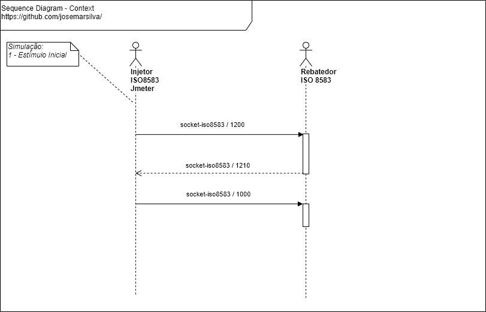

# README - apm-labs

## 1. Introdução

O projeto **apm-labs** consiste em explorar cenários de _performance_, _stress test_ e _tuning_ de aplicações.


## 2. Documentação

### 2.1. Diagrama de Caso de Uso (Use Case Diagram)

 


### 2.2. Diagrama de Implantação (Deploy Diagram)

 


### 2.3. Diagrama de BPMN (Business Process Modeling Notation)

 


### 2.4. Diagrama de Mapa Mental (Mind Map Diagram)

 


### 2.6. Diagrama de Sequencia (Sequence Diagram)

 


### 2.7. Estratégia de Branches (Branch Strategy Workflow)

Sugestão de [estratégia de branches e workflow](https://github.com/josemarsilva/eval-git#38-estrat%C3%A9gia-de-gerenciamento-de-branches) :
* `master`: pronto para produção
* `develop`: último desenvolvimento pronto para produção


## 3. Projeto

### 3.1. Pré-Requisitos, Pré-Condições e Premissas

#### a. Tecnologias e ferramentas

* NodeJS
* Docker
* Java JDK 1.8 (jar file includes runnable)


#### b. Ferramental de apoio

* Ferramenta: [Draw.IO](https://app.diagrams.net/) (_apoio_: necessário para editar os diagramas UML)
* Ferramenta: Plugin do Chrome - Draw IO (_apoio_: necessário para editar os diagramas UML)


### 3.2. Guia do Desenvolvedor e Administrador

* Faça um clone do projeto `git clone`. Use o _branch_ `master` se o _branch_ `develop` não estiver disponível
* Leia as documentações disponíves em "2. Documentação"  and "3.x. Guides, Patterns, Standard, Conventions and Best Practices"


### 3.3. Guia de Implantação, Configuração e Instalação

#### a. Instalando NodeJS (em Linux Ubuntu)

* https://github.com/josemarsilva/eval-virtualbox-vm-ubuntu-server#31-nodejs

#### b. Instalando Docker e Docker Composer (em Linux Ubuntu)

* https://github.com/josemarsilva/eval-virtualbox-vm-ubuntu-server/blob/master/README.md#41-docker---installation
* https://github.com/josemarsilva/eval-virtualbox-vm-ubuntu-server/blob/master/README.md#42-docker-composer---installation

#### c. Instalando/Clonando o repositório `apm-labs` no ambiente

```sh
$ sudo mkdir /opt
$ sudo mkdir /opt/githome
$ sudo chown -R $USER:$USER /opt/githome
$ cd /opt/githome
$ git clone https://github.com/josemarsilva/apm-labs.git
```


### 3.4. Guia de Execução, Demonstração e Cenários de Teste

#### a. Cenário no. 01: HTTP Server - Hello World

* n/a


### 3.5. Patterns, Standard, Conventions and Best Practices

* n/a


## I - Referências

* https://www.applicationperformancemanagement.org/
* https://www.comparitech.com/net-admin/application-performance-management-fundamentals/
* https://stackify.com/what-is-application-performance-monitoring/
* https://en.wikipedia.org/wiki/Application_performance_management
