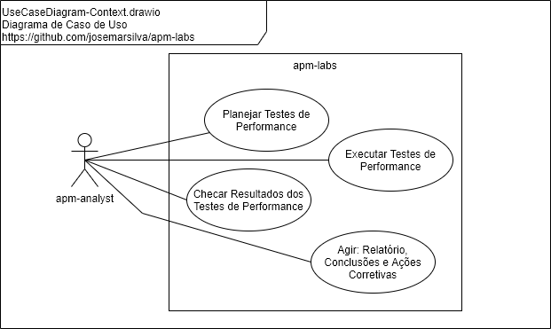

# README - apm-labs

## 1. Introdução

O projeto **apm-labs** consiste em explorar cenários de testes **_Performance Test_**, **_Stress Test_**, **_load Test_** e **_Tuning_** de aplicações.

* Tabela de Conteúdo
  * Introdução
  * Documentação
    * [Diagrama de Caso de Uso (Use Case Diagram)](#21-diagrama-de-caso-de-uso-use-case-diagram)
    * [Diagrama de Implantação (Deploy Diagram)](#22-diagrama-de-implantação-deploy-diagram)
    * [Diagrama de BPMN (Business Process Modeling Notation)](#23-diagrama-de-bpmn-business-process-modeling-notation)
    * [Diagrama de Mapa Mental (Mind Map Diagram)](#24-diagrama-de-mapa-mental-mind-map-diagram)
    * [Estratégia de Branches (Branch Strategy Workflow)](#25-estratégia-de-branches-branch-strategy-workflow)
    * [Glossário de Termos (Glossary)](#26-glossário-de-termos-glossary)
    * [Design Patterns, Standard, Conventions and Best Practices](#27-design-patterns-standard-conventions-and-best-practices)
      * Diagrama de Sequencia - Synchronous Request / Response
      * Diagrama de Sequencia - Synchronous Request / Acknowledge
      * Diagrama de Sequencia - Synchronous Request / Acknowledge / Poll
      * Diagrama de Sequencia - Synchronous Request / Acknowledge / Callback
      * Diagrama de Sequencia - Synchronous Request / Acknowledge / Relay / Pool
      * Diagrama de Sequencia - Synchronous Request / Acknowledge / Relay / Callback
    * [Considerações Gerais](#28-considerações-gerais)
  * Projeto
    * [Pré-Requisitos, Pré-Condições e Premissas](#31-pré-requisitos-pré-condições-e-premissas)
    * [Guia do Desenvolvedor e Administrador](#32-guia-do-desenvolvedor-e-administrador)
    * [Guia de Implantação, Configuração e Instalação](#32-guia-do-desenvolvedor-e-administrador)
    * [Guia de Execução, Demonstração e Cenários de Teste](#34-guia-de-execução-demonstração-e-cenários-de-teste)
      * [Performance Test - injetar (Browser, Curl, Postman, SoapUI e JMeter) vs rebater (HTTP e JSON WebServer) vs Ferramentas](#341-performance-test---injetar-browser-curl-postman-soapui-e-jmeter-vs-rebater-http-e-json-webserver-vs-ferramentas)
      * [Performance Test - Teste de Sanidade, Carga e Estresse com Json API's GET e POST](#342-performance-test---teste-de-sanidade-carga-e-estresse-com-json-apis-get-e-post)
  * [I - Referências](#i---referências)

## 2. Documentação

### 2.1. Diagrama de Caso de Uso (Use Case Diagram)

 

### 2.2. Diagrama de Implantação (Deploy Diagram)

 

### 2.3. Diagrama de BPMN (Business Process Modeling Notation)

 

### 2.4. Diagrama de Mapa Mental (Mind Map Diagram)

 

### 2.5. Estratégia de Branches (Branch Strategy Workflow)

Sugestão de [estratégia de branches e workflow](https://github.com/josemarsilva/eval-git#38-estrat%C3%A9gia-de-gerenciamento-de-branches) :
* `master`: pronto para produção
* `develop`: último desenvolvimento pronto para produção

### 2.6. Glossário de Termos (Glossary)

De uma forma geral, vamos tentar <ins>definir</ins> e <ins>caracterizar</ins> alguns dos termos utilizados neste projeto para permitir uma melhor compreensão e entendimento:

* **Teste de Capacidade _(Capacity Test)_**: semelhante ao teste de carga, tem como objetivo identificar os limites que a aplicação</ins> é capaz de suportar, <ins>dentro de parâmetros de qualidades definidos</ins>, quando submetida a elevação da quantidade de carga de usuários ou transações
* **Teste de Carga _(Load Test)_**: tem como objetivo avaliar a capacidade da aplicação de manter a qualidade de desempenho <ins>quando submetida a quantidades diversas</ins> de usuários ou transações
* **Teste de Escalabilidade _(Scalability Test)_**: tem como objetivo determinar a <ins>eficácia da aplicação em suportar aumento de carga</ins>
* **Teste de Sanidade _(Sanity Test)_**: tem como objetivo indentificar se a aplicaçao está <ins>respondendo corretamente</ins>
* **Teste de Estresse _(Stress Test)_**: tem como objetivo <ins>encontrar o limite da aplicação</ins> ao submetê-la a cargas que estão no limite ou acima do limite especificado inicialmente de usuários ou transações
* **Teste de Volume _(Volume Test)_**: tem como objetivo avaliar capacidade da aplicação quando submetida a <ins>elevação da quantidade de dados</ins> que o sistema pode gerenciar

### 2.7. [Design Patterns, Standard, Conventions and Best Practices](./doc/README-design-patterns-standard-conventions-and-best-practices.md)

* Diagrama de Sequencia - Synchronous Request / Response
* Diagrama de Sequencia - Synchronous Request / Acknowledge
* Diagrama de Sequencia - Synchronous Request / Acknowledge / Poll
* Diagrama de Sequencia - Synchronous Request / Acknowledge / Callback
* Diagrama de Sequencia - Synchronous Request / Acknowledge / Relay / Pool
* Diagrama de Sequencia - Synchronous Request / Acknowledge / Relay / Callback

### 2.8. Considerações Gerais

É importante lembrar que a quantificação, metrificação ou definição dos parâmetros de qualidade *não se dá em termos absolutos*, isto é cada negócio, cliente, sistema ou funcionalidade podem ter parâmetros de qualidade diferentes para: qualidade de desempenho, limite aceitáveis de ... (% CPU, tempo de resposta, etc) e definição de qual o melhor tipo de teste aplicar

## 3. Projeto

### 3.1. Pré-Requisitos, Pré-Condições e Premissas

#### a. Tecnologias e ferramentas

* NodeJS
* JMeter
* Docker (ou ambiente com todas ferramentas instaladas e disponíveis)
* SOAP UI (apenas para sanidade e comparativo)
* Postman (apenas para sanidade e comparativo)
* Curl(Window e Linux - apenas para sanidade e comparativo)
* Powershell(Windows) (apenas para sanidade e comparativo)
* VirtualBox (ou ambiente linux disponível)

#### b. Ferramental de apoio

* Ferramenta: [Draw.IO](https://app.diagrams.net/) (_apoio_: necessário para editar os diagramas UML)
* Ferramenta: Planilha Excel `jmeter-script-plans-and-results-beautifier.xlsx` para compilar as métricas de _elapsed time_ e _tps_ e gerar imagens padronizadas de gráficos de planos e resultados.

### 3.2. Guia do Desenvolvedor e Administrador

* Faça um clone do projeto `git clone`. Use o _branch_ `master` se o _branch_ `develop` não estiver disponível
* Leia as documentações disponíves em "2. Documentação"  and "3.x. Design Patterns, Standard, Conventions and Best Practices"

### 3.3. [Guia de Implantação, Configuração e Instalação](./doc/README-guia-implantacao-configuracao-instalacao.md)

* Instalando/Clonando este repositório no ambiente
* Instalando NodeJS (em Linux Ubuntu)
* Instalando Docker e Docker Composer (em Linux Ubuntu)
* Instalando JMeter

### 3.4. Guia de Execução, Demonstração e Cenários de Teste

#### [3.4.1. Performance Test - injetar (Browser, Curl, Postman, SoapUI e JMeter) vs rebater (HTTP e JSON WebServer) vs ferramentas](./doc/README-guia-exec-demo-teste-injetar-rebater-web-json-server-tools-benchmark.md)

* **Objetivo**: O objetivo deste cenário de testes é avaliar as ferramentas na atividade de *Teste de Carga*
* **Cenários**:
  * 01 - Sanity Test / Browser / HTTP WEB
  * 01.b - Sanity Test / Browser / JSON REST
  * 02 - Load Test / Curl(windows) / HTTP WEB / 1 user
  * 02.b - Load Test / Curl(windows) / HTTP WEB / 10 user
  * 02.c - Load Test / Curl(windows) / JSON REST / 1 user
  * 02.d - Load Test / Curl(windows) / JSON REST / 10 user
  * 03 - Load Test / Postman / JSON REST
  * 04 - Load Test / SoapUI / JSON REST
  * 05 - Load Test / JMeter / HTTP WEB
  * 05.b - Load Test / JMeter / HTTP WEB
  * 05.c - Load Test / JMeter / JSON REST
  * 05.d - Load Test / JMeter / JSON REST

#### [3.4.2. Performance Test - Teste de Sanidade, Carga e Estresse com Json API's GET e POST](./doc/README-guia-exec-demo-teste-sanity-loadtest-stresstest-json-api-get-post.md)

* **Objetivo**: O objetivo deste cenário de testes é avaliar se uma <ins>API</ins> construída em <ins>NodeJS</ins> com um cadastro simples consegue suportar uma carga de 10 a 100 usuários simultâneos fazendo requisições de GET e POST. Para completar, desejamos estressar aplicação até saber qual o limite de usuários simultâneos.
* **Cenários**:
  * 01 - Sanity Test / Curl(windows) / REST API GET / 1 user e 1000 requests - Synchronous Request / Response
  * 02 - Sanity Test / Powershell(windows) / REST API GET/POST / 1 user, 1 requests - Synchronous Request / Response
  * 02.b - Load Test / Powershell(windows) / REST API GET/POST / 1 user, 100 requests - Synchronous Request / Response
  * 02.c - Load Test / Powershell(windows) / REST API GET/POST / 1 user, 1000 requests - Synchronous Request / Response
  * 03 - Load Test / JMeter / REST API GET/POST / 1 user, 100 requests - Synchronous Request / Response
  * 03.b - Load Test / JMeter / REST API GET/POST / 1 user, 1000 requests - Synchronous Request / Response
  * 03.c - Load Test / JMeter / REST API GET/POST / 10 user, 100 requests - Synchronous Request / Response
  * 03.d - Load Test / JMeter / REST API GET/POST / 10 user, 1000 requests - Synchronous Request / Response
  * 03.e - Load Test / JMeter / REST API GET/POST / 100 user, 100 requests - Synchronous Request / Response
  * 03.f - Load Test / JMeter / REST API GET/POST / 100 user, 1000 requests - Synchronous Request / Response

#### [3.4.3. Performance Test - Teste de Sanidade e Carga com robôs injetor e rebatedor ISO8583](./doc/README-guia-exec-demo-teste-sanity-loadtest-robo-injetor-rebatedor-iso8583.md)

* **Objetivo**: O objetivo deste cenário de testes é avaliar se um <ins>robô rebatedor ISO8583</ins> construída em <ins>NodeJS</ins> consegue suportar uma carga de 10 a 100 usuários simultâneos realizando 10 mil requisições ISO8583 em menos de 1 minuto. 
* **Cenários**:
  * 01 - Sanity Test / NodeJS ISO8583 Robots: Launcher vs Hitter / Injetor vs Rebatedor / 1 user, 100 requests - Synchronous Request / Response

## I - Referências

* APM - Application Management Performance
  * https://www.applicationperformancemanagement.org/
  * https://www.comparitech.com/net-admin/application-performance-management-fundamentals/
  * https://stackify.com/what-is-application-performance-monitoring/
  * https://en.wikipedia.org/wiki/Application_performance_management
  * [Quais os tipos de testes de desempenho](https://blog.cedrotech.com/entenda-o-que-sao-os-testes-de-desempenho/)
  * [Tipos de Testes de Performance](https://www.youtube.com/watch?v=HhShUc9OarE)
  * [Introdução e diferença entre Sanity Testing vs Smoke Testing](https://www.guru99.com/smoke-sanity-testing.html)
  * [Entendendo teste de software: Teste de Sanidade](https://willianjusten.com.br/entendendo-testes-de-software/#smoke)
* Design Patterns
  * [Service Design Patterns by Martin Fowler](https://martinfowler.com/books/sdp.html)
  * [Service Design Patterns - Request/Response](http://www.servicedesignpatterns.com/ClientServiceInteractions/RequestResponse)
  * [Service Design Patterns - Request/Acknowledge (Poll or Callback)](http://www.servicedesignpatterns.com/ClientServiceInteractions/RequestAcknowledge)
  * [Service Design Patterns - Asynchronous Response Handler](http://www.servicedesignpatterns.com/WebServiceInfrastructures/AsyncResponseHandler)
  * [Synchronous vs Asynchronous Services - Request/Response, Acoplamento Temporal e Client-side Blocking/Assynchronous Response Handler](http://nelsonbassetto.com/blog/2012/10/synchronous-x-asynchronous-services-parte-1/)
  * [Synchronous vs Asynchronous Services - Request/Acknowledge/Poll, Request/Acknowledge/Callback e Request/Acknowledge/Relay](http://nelsonbassetto.com/blog/2012/10/synchronous-x-asynchronous-services-parte-1/)
  * [Service Design Patterns (.pdf)](http://emadilms.ir/emadi/wp-content/uploads/2015/02/Robert-Daigneau-Service-Design-Patterns_-Fundamental-Design-Solutions-for-SOAP-WSDL-and-RESTful-Web-Services-Addison-Wesley-Professional-2011.pdf)
* NodeJS
  * [How to Install NodeJS](https://blog.teamtreehouse.com/install-node-js-npm-windows)
  * [Download NodeJS Installer](https://nodejs.org/en/download/)
  * [Construindo um Servidor Web com NodeJS](https://www.devmedia.com.br/construindo-um-servidor-web-com-node-js/32023)
  * [Construindo um Servidor Json com NodeJS](https://egghead.io/lessons/javascript-creating-demo-apis-with-json-server)
  * [Overview of Blocking vs Non-Blocking](https://nodejs.org/en/docs/guides/blocking-vs-non-blocking/)
  * [Nodejs basic declaration](https://www.codegrepper.com/code-examples/delphi/how+to+declare+an+integer+value+in+js)
  * [NodeJS Primeiros Passos: Servidor HTTP Básico](https://www.youtube.com/watch?v=5L5-EoJbMfY)
  * [NodeJS Assíncrono: Entenda de vez Callbacks, Promises e Async/Await](https://www.youtube.com/watch?v=7Bs4-rqbCQc)
  * [NodeJS Json Server](https://www.npmjs.com/package/json-server)
  * [NodeJS Mastering REST API's](https://www.udemy.com/course/mastering-rest-apis-in-nodejs-zero-to-hero/)
  * [NodeJS Building a simple REST API with Express](https://medium.com/@onejohi/building-a-simple-rest-api-with-nodejs-and-express-da6273ed7ca9)
  * [NodeJS API + HTTP + REST Exemplo](https://imasters.com.br/back-end/api-http-rest-conceito-e-exemplo-em-node-js)
  * [NodeJS command line parser](https://nodejs.org/en/knowledge/command-line/how-to-parse-command-line-arguments/#:~:text=In%20Node.,for%20'argument%20values')
  * [NodeJS pacote ISO8583](https://www.npmjs.com/package/iso-8583)
  * [NodeJS Net Documentation](https://nodejs.org/api/net.html)
  * [NodeJS Net Tutorial Basico](https://riptutorial.com/node-js/example/22406/a-simple-tcp-client)
  * [NodeJS TCP Simple Client/Server](https://gist.github.com/sid24rane/2b10b8f4b2f814bd0851d861d3515a10)
  * [NodeJS TCP Simple Client/Server (2)](https://gist.github.com/tedmiston/5935757)
* JMeter
  * [JMeter - User Manual, Getting Started, Best Practices](https://jmeter.apache.org/usermanual/)
  * [JMeter - Testes de Carga](http://shipit.resultadosdigitais.com.br/blog/testes-de-carga-com-jmeter/)
  * [JMeter - Teste de Performance](https://www.devmedia.com.br/teste-de-performance-com-jmeter/34621)
* Testes de Performance
  * [Introdução a Teste de Performance de Software](https://www.softwaretestinghelp.com/introduction-to-performance-testing-loadrunner-training-tutorial-part-1/)
* ISO8583
  * [ISO 8583 Complete Guide English](https://www.amazon.com.br/ISO-8583-Complete-Guide-English-ebook/dp/B085C18P9K)
  * [Roehrs, Alex. Mestrado Acadêmico - Computação Aplicada - 4iPay: Modelo para Sistemas de Pagamento Móvel em Comércio Ubíquo](http://www.repositorio.jesuita.org.br/bitstream/handle/UNISINOS/3140/4iPay.pdf) - páginas: 69 e 70
* Github README.md writing sintax
  * [Basic Github Markdown Writing Format](https://docs.github.com/pt/free-pro-team@latest/github/writing-on-github/basic-writing-and-formatting-syntax)  
  * [Github Markdown Chead Sheet](https://guides.github.com/pdfs/markdown-cheatsheet-online.pdf)
  * [Github Mastering Markdown](https://guides.github.com/features/mastering-markdown/#what)
