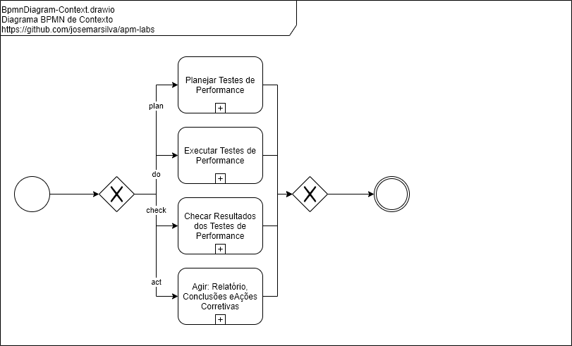
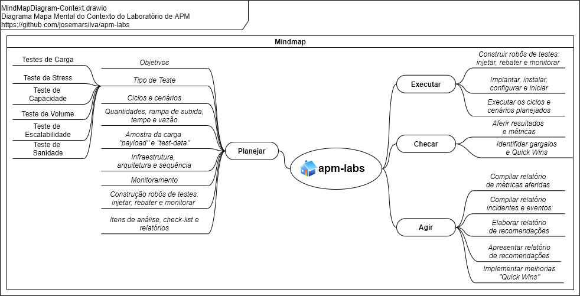

# README - apm-labs

## 1. Introdução

O projeto **apm-labs** consiste em explorar cenários de testes **_Performance Test_**, **_Stress Test_**, **_load Test_** e **_Tuning_** de aplicações.

* Tabela de Conteúdo
  * Introdução
  * Documentação
    * Diagrama de Caso de Uso (Use Case Diagram)
    * Diagrama de Implantação (Deploy Diagram)
    * Diagrama de BPMN (Business Process Modeling Notation)
    * Diagrama de Mapa Mental (Mind Map Diagram)
    * Estratégia de Branches (Branch Strategy Workflow)
    * Glossário de Termos (Glossary)
    * Aviso
  * Projeto
    * Pré-Requisitos, Pré-Condições e Premissas
    * Guia do Desenvolvedor e Administrador
    * Guia de Implantação, Configuração e Instalação
    * Guia de Execução, Demonstração e Cenários de Teste
    * Design Patterns, Standard, Conventions and Best Practices
  * I - Referências


## 2. Documentação

### 2.1. Diagrama de Caso de Uso (Use Case Diagram)

 


### 2.2. Diagrama de Implantação (Deploy Diagram)

 


### 2.3. Diagrama de BPMN (Business Process Modeling Notation)

 


### 2.4. Diagrama de Mapa Mental (Mind Map Diagram)

 


### 2.5. Estratégia de Branches (Branch Strategy Workflow)

Sugestão de [estratégia de branches e workflow](https://github.com/josemarsilva/eval-git#38-estrat%C3%A9gia-de-gerenciamento-de-branches) :
* `master`: pronto para produção
* `develop`: último desenvolvimento pronto para produção


### 2.6. Glossário de Termos (Glossary)

De uma forma geral, vamos tentar <ins>definir</ins> e <ins>caracterizar</ins> alguns dos termos utilizados neste projeto para permitir uma melhor compreensão e entendimento:

* **Teste de Capacidade _(Capacity Test)_**: semelhante ao teste de carga, tem como objetivo identificar os limites que a aplicação</ins> é capaz de suportar, <ins>dentro de parâmetros de qualidades definidos</ins>, quando submetida a elevação da quantidade de carga de usuários ou transações
* **Teste de Carga _(Load Test)_**: tem como objetivo avaliar a capacidade da aplicação de manter a qualidade de desempenho <ins>quando submetida a quantidades diversas</ins> de usuários ou transações
* **Teste de Escalabilidade _(Scalability Test)_**: tem como objetivo determinar a <ins>eficácia da aplicação em suportar aumento de carga</ins>
* **Teste de Sanidade _(Sanity Test)_**: tem como objetivo indentificar se a aplicaçao está <ins>respondendo corretamente</ins>
* **Teste de Estresse _(Stress Test)_**: tem como objetivo <ins>encontrar o limite da aplicação</ins> ao submetê-la a cargas que estão no limite ou acima do limite especificado inicialmente de usuários ou transações
* **Teste de Volume _(Volume Test)_**: tem como objetivo avaliar capacidade da aplicação quando submetida a <ins>elevação da quantidade de dados</ins> que o sistema pode gerenciar


### 2.7. Avisos

É importante lembrar que a quantificação, metrificação ou definição dos parâmetros de qualidade *não se dá em termos absolutos*, isto é cada negócio, cliente, sistema ou funcionalidade podem ter parâmetros de qualidade diferentes para: qualidade de desempenho, limite aceitáveis de ... (% CPU, tempo de resposta, etc) e definição de qual o melhor tipo de teste aplicar


## 3. Projeto

### 3.1. Pré-Requisitos, Pré-Condições e Premissas

#### a. Tecnologias e ferramentas

* NodeJS
* JMeter
* Docker (ou ambiente com todas ferramentas instaladas e disponíveis)
* SOAP UI (apenas para sanidade e comparativo)
* Postman (apenas para sanidade e comparativo)
* Curl(Window e Linux - apenas para sanidade e comparativo)
* VirtualBox (ou ambiente linux disponível)


#### b. Ferramental de apoio

* Ferramenta: [Draw.IO](https://app.diagrams.net/) (_apoio_: necessário para editar os diagramas UML)


### 3.2. Guia do Desenvolvedor e Administrador

* Faça um clone do projeto `git clone`. Use o _branch_ `master` se o _branch_ `develop` não estiver disponível
* Leia as documentações disponíves em "2. Documentação"  and "3.x. Design Patterns, Standard, Conventions and Best Practices"


### 3.3. Guia de Implantação, Configuração e Instalação

#### a. Instalando/Clonando este repositório no ambiente

* Windows

```cmd
C:\> md githome
C:\> cd githome
C:\githome> git clone https://github.com/josemarsilva/apm-labs.git
```

* Linux

```sh
$ sudo mkdir /opt
$ sudo mkdir /opt/githome
$ sudo chown -R $USER:$USER /opt/githome
$ cd /opt/githome
$ git clone https://github.com/josemarsilva/apm-labs.git
```


#### b. Instalando NodeJS (em Linux Ubuntu)

* https://github.com/josemarsilva/eval-virtualbox-vm-ubuntu-server#31-nodejs


#### c. Instalando Docker e Docker Composer (em Linux Ubuntu)

* https://github.com/josemarsilva/eval-virtualbox-vm-ubuntu-server/blob/master/README.md#41-docker---installation
* https://github.com/josemarsilva/eval-virtualbox-vm-ubuntu-server/blob/master/README.md#42-docker-composer---installation


#### d. Instalando JMeter

* Localize a última versão de distribuição do _Binaries_ do JMeter em https://jmeter.apache.org/download_jmeter.cgi

```sh
$ sudo mkdir /opt
$ cd /opt
$ wget https://downloads.apache.org//jmeter/binaries/apache-jmeter-5.3.tgz
$ tar -xvf apache-jmeter-5.3.tgz
$ sudo chown -R $USER:$USER /opt/apache-jmeter-5.3
$ rm apache-jmeter-5.3.tgz
```


### 3.4. Guia de Execução, Demonstração e Cenários de Teste

#### 3.4.1. Performance Test - injetar (Browser, Curl, Postman, SoapUI e JMeter) vs rebater (Web Server)

##### Planejar

* **Objetivo**: O objetivo deste cenário de testes é avaliar as ferramentas na atividade de *Teste de Carga*
* **Tipo de Testes**: *Teste de Carga*
* **Ciclos e Cenários**: Executar um único ciclo para cada cenário com cada uma das ferramentas

| Cenário      | Detalhamento |
| :---         |     :---:    |
| Cenário-01   | *Teste de Carga (Load Test)* da aplicação com um `Browser` |
| Cenário-02   | *Teste de Carga (Load Test)* da aplicação com um `Curl(windows)` com variações de quantidades, rampa de subida, tempo e vazão |
| Cenário-03   | *Teste de Carga (Load Test)* da aplicação com um `Postman` |
| Cenário-04   | *Teste de Carga (Load Test)* da aplicação com um `SoapUI` |
| Cenário-05   | *Teste de Carga (Load Test)* da aplicação com um `JMeter` |


* **Quantidades, rampa de subida, tempo e vazão**:

| Quantidade _(qty)_ | Rampa _(ramp up)_ | Tempo _(dur)_ | Vazão _(throughput)_ | Obs  |
| ---:               | :---:             | :---:         | :---                 | :--- |
| 1000 _requests_    | n/a               | n/a           | Cenários com 1 e 10 _threads_ simultâneas | n/a  |


* **Amostra da carga "payload" e "test-data"**: n/a
* **Infraestrutura, arquitetura e sequência**:

 


* **Monitoramento**: n/a
* **Construção robôs de testes: injetar, rebater e monitorar**:
  * Os robôs de teste para _injetar_:
    * `win-cmd-curl-script-webserver.bat` construído e disponível em `./src/curl-scripts`
  * Os robôs de teste para _rebater_:
    * `nodejs-webserver.js` construído e disponível em `./src/nodejs-webserver`
  * Os robôs de teste para _monitorar_:
    * n/a

* **Itens de análise, check-list e relatórios**: Quadro comparativo das características de cada ferramenta, facilidades, dificuldades, etc

##### Executar

* *Iniciar* o servidor web local *nodejs-webserver*

```cmd
apm-labs> cd src/nodejs-webserver
nodejs-webserver> node nodejs-webserver.js
```

* *Executar* um *Teste de Sanidade (Sanity Test)* com o `Cenário-01` abrindo a seguinte URL pelo browser de sua máquina

```url
+--------------------------+
| http://localhost:3000/   |
+--------------------------+
| Hello Simple HTTP Server |
+--------------------------+
```

* *Executar* os *Teste de Carga (Load Test)* com o `Cenário-01`:
  * Marque a data e hora inicial
  * Agora clique no botão F5(Refresh) a quantidade de vezes planejadas (kkkkkk)
  * Marque a data e hora final
  * Encontre a diferença de tempo entre data e hora final e inicial em segundos e divida pela quantidade
  * Pronto! Você encontrou a *métrica* de *TPS - Transações por Segundos* deste cenário


### 3.5. Design Patterns, Standard, Conventions and Best Practices

* n/a


## I - Referências

* APM - Application Management Performance
  * https://www.applicationperformancemanagement.org/
  * https://www.comparitech.com/net-admin/application-performance-management-fundamentals/
  * https://stackify.com/what-is-application-performance-monitoring/
  * https://en.wikipedia.org/wiki/Application_performance_management
  * [Quais os tipos de testes de desempenho](https://blog.cedrotech.com/entenda-o-que-sao-os-testes-de-desempenho/)
  * [Tipos de Testes de Performance](https://www.youtube.com/watch?v=HhShUc9OarE)
  * [Introdução e diferença entre Sanity Testing vs Smoke Testing](https://www.guru99.com/smoke-sanity-testing.html)
  * [Entendendo teste de software: Teste de Sanidade](https://willianjusten.com.br/entendendo-testes-de-software/#smoke)
* Design Patterns
  * [Service Design Patterns by Martin Fowler](https://martinfowler.com/books/sdp.html)
  * [Service Design Patterns - Request/Response](http://www.servicedesignpatterns.com/ClientServiceInteractions/RequestResponse)
  * [Service Design Patterns - Request/Acknowledge (Poll or Callback)](http://www.servicedesignpatterns.com/ClientServiceInteractions/RequestAcknowledge)
  * [Service Design Patterns - Asynchronous Response Handler](http://www.servicedesignpatterns.com/WebServiceInfrastructures/AsyncResponseHandler)
  * [Synchronous vs Asynchronous Services - Request/Response, Acoplamento Temporal e Client-side Blocking/Assynchronous Response Handler](http://nelsonbassetto.com/blog/2012/10/synchronous-x-asynchronous-services-parte-1/)
  * [Synchronous vs Asynchronous Services - Request/Acknowledge/Poll, Request/Acknowledge/Callback e Request/Acknowledge/Relay](http://nelsonbassetto.com/blog/2012/10/synchronous-x-asynchronous-services-parte-1/)
  * [Service Design Patterns (.pdf)](http://emadilms.ir/emadi/wp-content/uploads/2015/02/Robert-Daigneau-Service-Design-Patterns_-Fundamental-Design-Solutions-for-SOAP-WSDL-and-RESTful-Web-Services-Addison-Wesley-Professional-2011.pdf)
* NodeJS
  * [How to Install NodeJS](https://blog.teamtreehouse.com/install-node-js-npm-windows)
  * [Download NodeJS Installer](https://nodejs.org/en/download/)
  * [Construindo um Servidor Web com NodeJS](https://www.devmedia.com.br/construindo-um-servidor-web-com-node-js/32023)
  * [Construindo um Servidor Json com NodeJS](https://egghead.io/lessons/javascript-creating-demo-apis-with-json-server)
  * [Overview of Blocking vs Non-Blocking](https://nodejs.org/en/docs/guides/blocking-vs-non-blocking/)
  * [NodeJS Primeiros Passos: Servidor HTTP Básico](https://www.youtube.com/watch?v=5L5-EoJbMfY)
  * [NodeJS Assíncrono: Entenda de vez Callbacks, Promises e Async/Await](https://www.youtube.com/watch?v=7Bs4-rqbCQc)
* JMeter
  * [JMeter - Testes de Carga](http://shipit.resultadosdigitais.com.br/blog/testes-de-carga-com-jmeter/)
  * [JMeter - Teste de Performance](https://www.devmedia.com.br/teste-de-performance-com-jmeter/34621)
* Testes de Performance
  * [Introdução a Teste de Performance de Software](https://www.softwaretestinghelp.com/introduction-to-performance-testing-loadrunner-training-tutorial-part-1/)
* Github README.md writing sintax
  * [Basic Github Markdown Writing Format](https://docs.github.com/pt/free-pro-team@latest/github/writing-on-github/basic-writing-and-formatting-syntax)  
  * [Github Markdown Chead Sheet](https://guides.github.com/pdfs/markdown-cheatsheet-online.pdf)
  * [Github Mastering Markdown](https://guides.github.com/features/mastering-markdown/#what)
