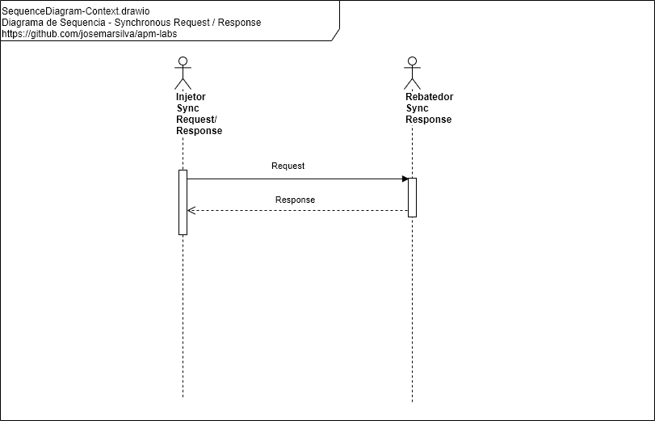
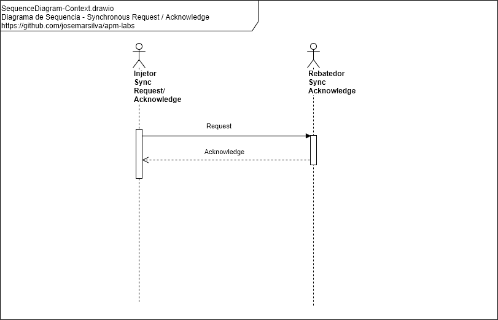
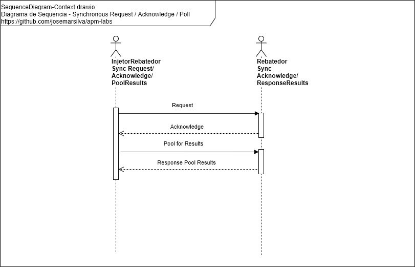
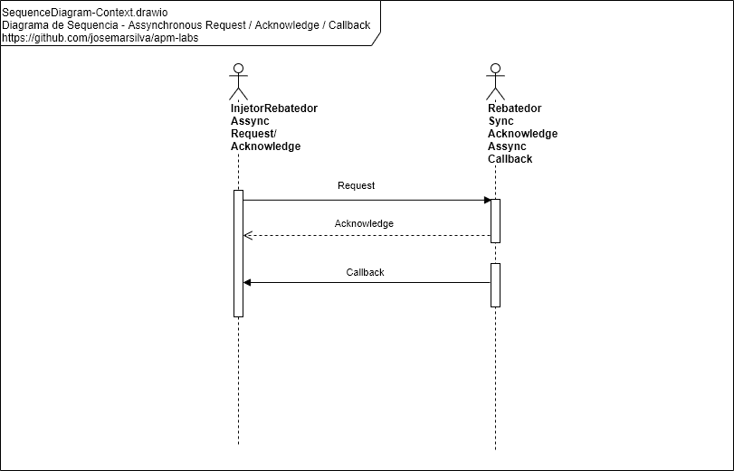
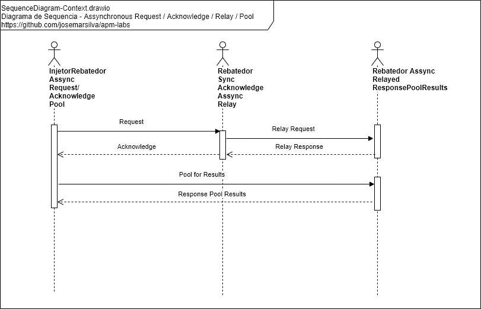
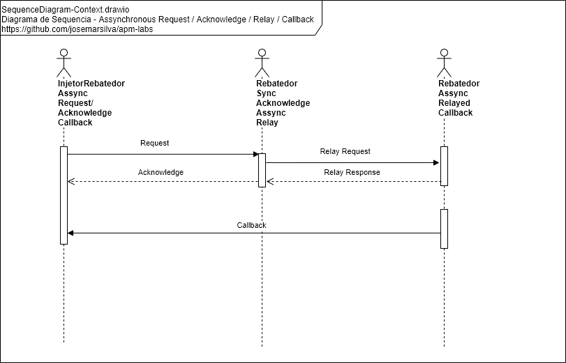

## README-design-patterns-standard-conventions-and-best-practices

### [2. Documentação](./../README.md#2-documentação)

### [2.7 Design Patterns, Standard, Conventions and Best Practices](./../README.md#27-design-patterns-standard-conventions-and-best-practices)

#### 2.7.1. Diagrama de Sequencia - Synchronous Request / Response

 

#### 2.7.2. Diagrama de Sequencia - Synchronous Request / Acknowledge

 

#### 2.7.3. Diagrama de Sequencia - Synchronous Request / Acknowledge / Poll

#### 2.7.4. Diagrama de Sequencia - Synchronous Request / Acknowledge / Callback

#### 2.7.5. Diagrama de Sequencia - Synchronous Request / Acknowledge / Relay / Pool

#### 2.7.6. Diagrama de Sequencia - Synchronous Request / Acknowledge / Relay / Callback

