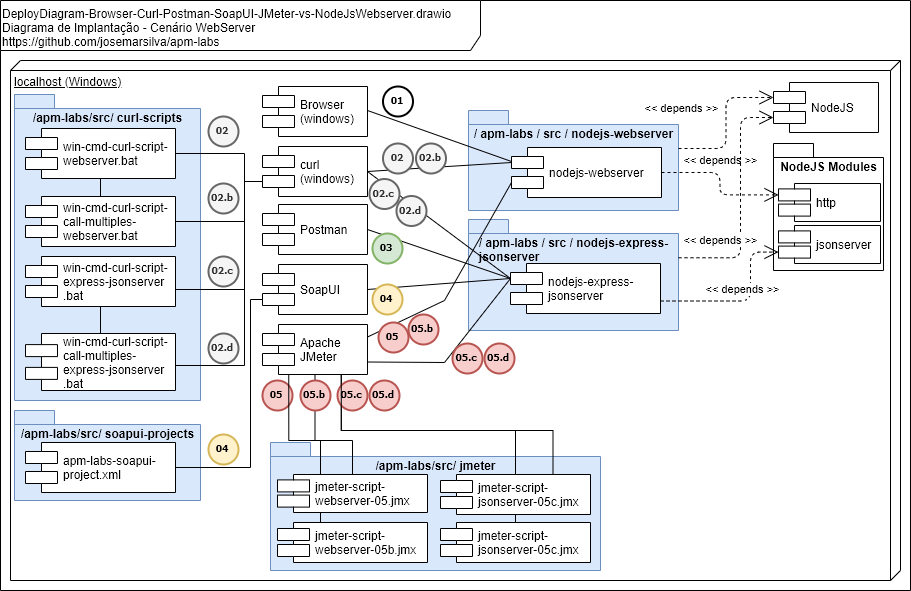

### README-guia-exec-demo-teste-injetar-rebater-web-json-server-tools-benchmark.md

[## 3. Projeto](./../README.md#3-projeto)

[### 3.4. Guia de Execução, Demonstração e Cenários de Teste](./../README.md#34-guia-de-execução-demonstração-e-cenários-de-teste)

#### 3.4.1. Performance Test - injetar (Browser, Curl, Postman, SoapUI e JMeter) vs rebater (HTTP e JSON WebServer)

##### Planejar

* **Objetivo**: O objetivo deste cenário de testes é avaliar as ferramentas na atividade de *Teste de Carga*
* **Tipo de Testes**: *Teste de Carga*
* **Ciclos e Cenários**: Executar um único ciclo para cada cenário com cada uma das ferramentas

| Cenário | Detalhamento |
| :------ | :---         |
| **01**  | *Teste de Sanidade (Sanity Test)* da aplicação com um `Browser` com variações: (HTTP WEB e JSON REST server) |
| **02**  | *Teste de Carga (Load Test)* da aplicação com um `Curl(windows)` com variações: (HTTP WEB e JSON REST server) e variações de (quantidades, rampa de subida, tempo e usuários simultâneos) |
| **03**  | *Teste de Carga (Load Test)* da aplicação com um `Postman` |
| **04**  | *Teste de Carga (Load Test)* da aplicação com um `SoapUI` |
| **05**  | *Teste de Carga (Load Test)* da aplicação com um `JMeter` |


* **Quantidades, rampa de subida, tempo e usuários simultâneos**:

| Quantidade _(qty)_ | Rampa _(ramp-up)_ | Tempo _(dur)_ | Usuários _(threads)_ | Obs  |
| ---:               | :---:             | :---:         | :---                 | :--- |
| 1000 _requests_    | n/a               | n/a           | Cenários com 1 e 10 _threads_ simultâneas | n/a  |


* **Amostra da carga "payload" e "test-data"**: n/a
* **Infraestrutura, arquitetura e sequência**:
  * Infraestrutura:
    * Intel Core i5-8250U CPU @ 1.60 GHz 1.80 GHz - RAM 16 GB - Windows 10 Pro
  * Arquitetura:
 
  * Sequência:

 


* **Monitoramento**: n/a
* **Construção robôs de testes: injetar, rebater e monitorar**:
  * Os robôs de teste para _injetar_:
    * *Curl* scripts ( `win-cmd-curl-script-webserver.bat`, `win-cmd-curl-script-express-jsonserver.bat`, `win-cmd-curl-script-call-multiples-webserver.bat`, `win-cmd-curl-script-call-multiples-json-rest-server.bat` ) construído e disponível em `./src/curl-scripts`
    * *Postman* collection script construído e disponível em `https://www.getpostman.com/collections/1da862e11dc1c41dd8d9`
    * *SoapUI* project `apm-labs-soapui-project.xml` construído e disponível em `./src/soapui-projects`
    * *JMeter* scripts ( `jmeter-script-webserver-05.jmx`, `jmeter-script-webserver-05b.jmx`, `jmeter-script-jsonserver-05c.jmx` e `jmeter-script-jsonserver-05d.jmx` ) construído e disponível em `./src/jmeter-scripts`
  * Os robôs de teste para _rebater_:
    * `nodejs-webserver.js` construído e disponível em `./src/nodejs-webserver`
    * `nodejs-express-jsonserver.bat` construído e disponível em `./src/nodejs-express-jsonserver`
  * Os robôs de teste para _monitorar_:
    * n/a

* **Itens de análise, check-list e relatórios**: Quadro comparativo das características de cada ferramenta, facilidades, dificuldades, etc

##### Executar

###### Cenário-01

* *Iniciar* o servidor HTTP web local *nodejs-webserver*

```cmd
apm-labs> cd src/nodejs-webserver
nodejs-webserver> node nodejs-webserver.js
```

* *Executar* um *Teste de Sanidade (Sanity Test)* do `Cenário-01` abrindo a seguinte URL pelo browser de sua máquina

```url
+--------------------------+
| http://localhost:3000/   |
+--------------------------+
| Hello Simple HTTP Server |
+--------------------------+
```

* *Executar* os *Teste de Carga (Load Test)* do `Cenário-01`:
  * Marque a data e hora inicial
  * Agora clique no botão F5(Refresh) a quantidade de vezes planejadas (kkkkkk)
  * Marque a data e hora final
  * Encontre a diferença de tempo entre data e hora final e inicial em segundos e divida pela quantidade
  * Pronto! Você encontrou a *métrica* de *TPS - Transações por Segundos* deste cenário

* *Encerrar* o robô rebatedor `nodejs-webserver.js` iniciado com um ^C na tela do Windows Command onde ele está sendo executado

* *Iniciar* o servidor JSON web local *nodejs-express-jsonserver*

```cmd
apm-labs> cd src/nodejs-express-jsonserver
```cmd
apm-labs> cd src/nodejs-express-jsonserver
nodejs-express-jsonserver> npm install json-server
nodejs-express-jsonserver> echo nodejs-express-jsonserver.bat ou a linha de comando abaixo
nodejs-express-jsonserver> json-server --watch db-users.json
  \{^_^}/ hi!
  Loading db-users.json
  Done
  Resources
  http://localhost:3000/users
  Home
  http://localhost:3000
  Type s + enter at any time to create a snapshot of the database
  Watching...
```

* *Executar* um *Teste de Sanidade (Sanity Test)* do `Cenário-01.b` abrindo a seguinte URL pelo browser de sua máquina

```url
+---------------------------------------------------------------------+
| http://localhost:3000/users                                         |
+---------------------------------------------------------------------+
|                                                                     |
| [                                                                   |
|   {                                                                 |
|     "id": 1,                                                        |
|     "username": "josemarsilva",                                     |
|     "email": "josemarsilva@yahoo.com.br",                           |
|     "name": "Josemar Silva",                                        |
|     "status": "active",                                             |
|     "phone": "+55 11 3303-3200",                                    |
|     "website": "https://josemarsilva.s3.amazonaws.com/index.html",  |
|     "company": {                                                    |
|       "name": "Inmetrics",                                          |
|       "website": "http://www.inmetrics.com.br"                      |
|     }                                                               |
|   }                                                                 |
|   ]                                                                 |
+---------------------------------------------------------------------+
```


###### Cenário-02

* *Iniciar* o servidor HTTP web local *nodejs-webserver*

```cmd
apm-labs> cd src/nodejs-webserver
nodejs-webserver> node nodejs-webserver.js
```

* *Executar* os *Teste de Carga (Load Test)* do `Cenário-02`:
  * Execute `win-cmd-curl-script-webserver.bat`
  * Marque a data/hora inicial e final
  * Encontre a diferença de tempo entre data/hora final e inicial em segundos e divida pela quantidade
  * Pronto! Você encontrou a *métrica* de *TPS - Transações por Segundos* deste cenário

* *Executar* os *Teste de Carga (Load Test)* do `Cenário-02.b`:
  * Execute `win-cmd-curl-script-call-multiples-webserver.bat`
  * Obtenha a data/hora inicial e final em cada um dos arquivos (.log) de nomenclatura `win-cmd-curl-script-webserver-*.log`
  * Encontre a diferença média entre a data/hora final e inicial em segundos e divida pela quantidade
  * Pronto! Você encontrou a *métrica* de *TPS - Transações por Segundos* deste cenário

* *Encerrar* o robô rebatedor `nodejs-webserver.js` iniciado com um ^C na tela do Windows Command onde ele está sendo executado

* *Iniciar* o servidor JSON web local *nodejs-express-jsonserver*

```cmd
apm-labs> cd src/nodejs-express-jsonserver
```cmd
apm-labs> cd src/nodejs-express-jsonserver
nodejs-express-jsonserver> npm install json-server
nodejs-express-jsonserver> echo nodejs-express-jsonserver.bat ou a linha de comando abaixo
nodejs-express-jsonserver> json-server --watch db-users.json
  \{^_^}/ hi!
  Loading db-users.json
  Done
  Resources
  http://localhost:3000/users
  Home
  http://localhost:3000
  Type s + enter at any time to create a snapshot of the database
  Watching...
```

* *Executar* um *Teste de Sanidade (Sanity Test)* do `Cenário-02.c`:
  * Execute `win-cmd-curl-script-express-jsonserver.bat`
  * Marque a data/hora inicial e final
  * Encontre a diferença de tempo entre data/hora final e inicial em segundos e divida pela quantidade
  * Pronto! Você encontrou a *métrica* de *TPS - Transações por Segundos* deste cenário

* *Executar* os *Teste de Carga (Load Test)* com o `Cenário-02.d`:
  * Execute `win-cmd-curl-script-call-multiples-json-rest-server.bat`
  * Obtenha a data/hora inicial e final em cada um dos arquivos (.log) de nomenclatura `win-cmd-curl-script-express-jsonserver*.log`
  * Encontre a diferença média entre a data/hora final e inicial em segundos e divida pela quantidade
  * Pronto! Você encontrou a *métrica* de *TPS - Transações por Segundos* deste cenário

* *Encerrar* o robô rebatedor `nodejs-express-jsonserver` iniciado com um ^C na tela do Windows Command onde ele está sendo executado


###### Cenário-03

* *Iniciar* o servidor JSON web local *nodejs-express-jsonserver*

```cmd
apm-labs> cd src/nodejs-express-jsonserver
```cmd
apm-labs> cd src/nodejs-express-jsonserver
nodejs-express-jsonserver> npm install json-server
nodejs-express-jsonserver> echo nodejs-express-jsonserver ou a linha de comando abaixo
nodejs-express-jsonserver> json-server --watch db-users.json
  \{^_^}/ hi!
  Loading db-users.json
  Done
  Resources
  http://localhost:3000/users
  Home
  http://localhost:3000
  Type s + enter at any time to create a snapshot of the database
  Watching...
```

* *Executar* um *Teste de Carga (Load Test)* do `Cenário-03`:
  * Execute a ferramenta [`Postman`](https://www.postman.com/downloads/)
  * Importe a coleção (_Collections_) de _Scripts Postman_ a partir da seguinte url:
    * https://www.getpostman.com/collections/1da862e11dc1c41dd8d9
  * Execute o script GET [http://localhost:3000/users]
  * Observe os seguintes campos de resultados:
    * Status: 200 OK - Time: 515 ms - Size: 745 B
  * Encontre média em segundos das requisições
  * Pronto! Você encontrou a *métrica* de *TPS - Transações por Segundos* deste cenário


###### Cenário-04

* *Iniciar* o servidor JSON web local *nodejs-express-jsonserver*

```cmd
apm-labs> cd src/nodejs-express-jsonserver
```cmd
apm-labs> cd src/nodejs-express-jsonserver
nodejs-express-jsonserver> npm install json-server
nodejs-express-jsonserver> echo nodejs-express-jsonserver.bat ou a linha de comando abaixo
nodejs-express-jsonserver> json-server --watch db-users.json
  \{^_^}/ hi!
  Loading db-users.json
  Done
  Resources
  http://localhost:3000/users
  Home
  http://localhost:3000
  Type s + enter at any time to create a snapshot of the database
  Watching...
```

* *Executar* um *Teste de Carga (Load Test)* do `Cenário-04`:
  * Execute a ferramenta [`SoapUI`](https://www.soapui.org/downloads/soapui/)
  * Abra o projeto SoapUI `apm-labs` ou crie um novo projeto com o nome `apm-labs` e em seguida selecione-o
  * Com o *Project* `apm-labs` selecionado, em seguida selecione o *Test Suite* com o nome `cenario-04` 
  * Com o *Test Suite* `cenario-04` selecionado, em seguida selecione o *Test Case* com nome `REST JSON GET /users TestCase`
  * Com o *Test Case* `REST JSON GET /users TestCase` selecionado, em seguida selecione abaixo de `Test Steps` o *REST TestRequest* com nome `Request GET /users REST Test Request`
  * Com o *Project* `apm-labs` selecionado, em seguida clique com o botão invertido do mouse para abrir o menu de opções e selecione a *Menu Option* com o nome `Launch TestRunner`
  * Com a caixa de diálogo `Launch TestRunner` aberta:
    * Clique na aba `Basic` e em seguida no combo-box `Test Suite` selecione a opção `cenario-04`
    * Clique na aba `Basic` e em seguida no combo-box `Test Case` selecione a opção `REST JSON GET /users TestCase`
    * Clique na aba `Reports` e em seguida no check-box `Prints a summary reports to Conseole` marque-o como selecionado
    * Clique na aba `Basic` e em seguida no botão `Launch` clique para executar
  * Observe os seguintes campos de resultados:
    * Time Taken: 183ms
  * Encontre média em segundos das requisições
  * Pronto! Você encontrou a *métrica* de *TPS - Transações por Segundos* deste cenário


###### Cenário-05

* *Iniciar* o servidor HTTP web local *nodejs-webserver*

```cmd
apm-labs> cd src/nodejs-webserver
nodejs-webserver> node nodejs-webserver.js
```

* *Executar* os *Teste de Carga (Load Test)* do `Cenário-05`:
  * Execute a ferramenta [`JMeter`](https://jmeter.apache.org/download_jmeter.cgi)
  * Com a ferramenta *JMeter* iniciada, selecione e abra o script do JMeter (.jmx) `jmeter-script- webserver.jmx` 
  * Observe que este script JMeter possui um *Test Plan* com um único *Thread Group* configurado com uma única *Number of Threads(users)*, sem nenhuma configuração de *Ramp-up* e *Loop Count* configurado para 1000 repetições
  * Observe que abaixo de nosso *Thread Group* há um *HTTP Request* está configurado para acessar o endereço de nosso servidor `nodejs-webserver.js` na url `http://localhost` e porta `3000`.
  * Observe também que há alguns itens especiais: `View Results in Table`, `View Results in Tree` e `Summary Report`. Vamos falar mais deles após a execução
  * Clique na opção de menu `Run >> Clear All` e em seguida na opção de menu `Run >> Start`
  * Selecione os itens:  `View Results in Table`, `View Results in Tree` e `Summary Report`. Observe que todas as métricas da execução encontram-se neles, tais como as métricas individualizadas de cada execução, quantidade de amostras, % de erro de execução, tempos de cada requisição e métricas sumarizadas de tempos médio, mínimo, máximo e usuários simultâneos
  * Pronto! Você encontrou a *métrica* de *TPS - Transações por Segundos* deste cenário

###### Cenário-05.b

* *Executar* os *Teste de Carga (Load Test)* do `Cenário-05.b`:
  * Com a ferramenta *JMeter* iniciada, selecione e abra o script do JMeter (.jmx) `jmeter-script- webserver-05b.jmx` 
  * Observe que neste script o *Thread Group* está configurado com *Number of Threads(users)* = 10
  * Clique na opção de menu `Run >> Clear All` e em seguida na opção de menu `Run >> Start`
  * Selecione os itens:  `View Results in Table`, `View Results in Tree` e `Summary Report`. Observe que todas as métricas da execução encontram-se neles, tais como as métricas individualizadas de cada execução, quantidade de amostras, % de erro de execução, tempos de cada requisição e métricas sumarizadas de tempos médio, mínimo, máximo e usuários simultâneos
  * Pronto! Você encontrou a *métrica* de *TPS - Transações por Segundos* deste cenário

###### Cenário-05.c

* *Encerrar* o robô rebatedor `nodejs-webserver` iniciado com um ^C na tela do Windows Command onde ele está sendo executado

* *Iniciar* o servidor JSON web local *nodejs-express-jsonserver*

```cmd
apm-labs> cd src/nodejs-express-jsonserver
```cmd
apm-labs> cd src/nodejs-express-jsonserver
nodejs-express-jsonserver> npm install json-server
nodejs-express-jsonserver> echo nodejs-express-jsonserver.bat ou a linha de comando abaixo
nodejs-express-jsonserver> json-server --watch db-users.json
  \{^_^}/ hi!
  Loading db-users.json
  Done
  Resources
  http://localhost:3000/users
  Home
  http://localhost:3000
  Type s + enter at any time to create a snapshot of the database
  Watching...
```

* *Executar* os *Teste de Carga (Load Test)* do `Cenário-05.c`:
  * Com a ferramenta *JMeter* iniciada, selecione e abra o script do JMeter (.jmx) `jmeter-script- jsonserver-05c.jmx` 
  * Observe que neste script o *HTTP Request* está configurado com *Path* = `/users`
  * Observe que neste script o *Thread Group* está configurado com *Number of Threads(users)* = 1
  * Clique na opção de menu `Run >> Clear All` e em seguida na opção de menu `Run >> Start`
  * Selecione os itens:  `View Results in Table`, `View Results in Tree` e `Summary Report`. Observe que todas as métricas da execução encontram-se neles, tais como as métricas individualizadas de cada execução, quantidade de amostras, % de erro de execução, tempos de cada requisição e métricas sumarizadas de tempos médio, mínimo, máximo e usuários simultâneos
  * Pronto! Você encontrou a *métrica* de *TPS - Transações por Segundos* deste cenário

* *Executar* os *Teste de Carga (Load Test)* do `Cenário-05.d`:
  * Com a ferramenta *JMeter* iniciada, selecione e abra o script do JMeter (.jmx) `jmeter-script- jsonserver-05c.jmx` 
  * Observe que neste script o *HTTP Request* está configurado com *Path* = `/users`
  * Observe que neste script o *Thread Group* está configurado com *Number of Threads(users)* = 10
  * Clique na opção de menu `Run >> Clear All` e em seguida na opção de menu `Run >> Start`
  * Selecione os itens:  `View Results in Table`, `View Results in Tree` e `Summary Report`. Observe que todas as métricas da execução encontram-se neles, tais como as métricas individualizadas de cada execução, quantidade de amostras, % de erro de execução, tempos de cada requisição e métricas sumarizadas de tempos médio, mínimo, máximo e usuários simultâneos
  * Pronto! Você encontrou a *métrica* de *TPS - Transações por Segundos* deste cenário


##### Checar e Agir

* *Aferir* as métricas anotadas em cada um dos testes de cada um dos testes
* *Compilar* relatório com as métricas aferidas
* *Elaborar* relatório
* *Apresentar* relatório

* Relatório Comparativo de Ferramentas

| Cenário                                                 | Positivo     | Negativo                                  | Observações |
| :------                                                 | :---         | :---                                      | :---        |
| 01 - Sanity Test / `Browser` / HTTP WEB e JSON REST     | simplicidade | processo manual, lento e pouco ergonômico | Indicado para *Sanity Test* |
| 02 - Load Test / `Curl(windows)` / HTTP WEB e JSON REST | simplicidade | aferição de resultados manual             | Indicado para solução rápida |
| 03 - Load Test / `Postman` / HTTP WEB e JSON REST       | comodidade   | pouco automatizado e aferição manual      | Indicado para mapeamento de payload e *Sanity Test* |
| 04 - Load Test / `SoapUI` / HTTP WEB e JSON REST        | comodidade   | pouco automatizado e aferição manual      | Indicado para mapeamento de payload e *Sanity Test* |
| 05 - Load Test / `JMeter` / HTTP WEB e JSON REST        | completo     | requer conhecimento de uso da ferramenta  | Indicado para maioria das situações |

* Relatório Comparativo de Métricas de Cenários

| Cenário | Métricas     | Observações  |
| :------ | :---         | :---         |
| 01 - Sanity Test / `Browser` / HTTP WEB        | Qtde: 160,  Threads: 1,  Elapsed: 60 s, TPS: 2,6 | Execução click de mouse e aferição pelo relógio |
| 01.b - Sanity Test / `Browser` / JSON REST     | Qtde: 190,  Threads: 1,  Elapsed: 60 s, TPS: 3,16 | Execução click de mouse e aferição pelo relógio |
| 02 - Load Test / `Curl(windows)` / HTTP WEB / 1 user     | Qtde: 1000, Threads: 1,  Elapsed: 57 s, TPS: 17,54 | Execução automatizada script |
| 02.b - Load Test / `Curl(windows)` / HTTP WEB / 10 user  | Qtde: 1000, Threads: 10, Elapsed: 2.392 s, TPS: 4,18 | Execução automatizada script |
| 02.c - Load Test / `Curl(windows)` / JSON REST / 1 user  | Qtde: 1000, Threads: 1,  Elapsed:  263 s, TPS: 3,80 | Execução automatizada script |
| 02.d - Load Test / `Curl(windows)` / JSON REST / 10 user | Qtde: 1000, Threads: 10, Elapsed: 3130 s, TPS: 3,19 | Execução automatizada script |
| 03 - Load Test / `Postman` / JSON REST         | Qtde: 1,    Threads: 1,  Elapsed: 0,531 s, TPS: 1,88 | Execução e aferição manual |
| 04 - Load Test / `SoapUI` / JSON REST          | Qtde: 1,    Threads: 1,  Elapsed: 0,63 s, TPS: 1,56 | Execução e aferição manual |
| 05 - Load Test / `JMeter` / HTTP WEB           | Qtde: 1000, Threads: 1,  Elapsed: 1,47 s, TPS: 1582 | Execução e aferição automáticas |
| 05.b - Load Test / `JMeter` / HTTP WEB         | Qtde: 1000, Threads: 10,  Elapsed: 3s, TPS: 2055 | Execução e aferição automáticas |
| 05.c - Load Test / `JMeter` / JSON REST        | Qtde: 1000, Threads: 10, Elapsed: , TPS:  | Execução e aferição automáticas |
| 05.d - Load Test / `JMeter` / JSON REST        | Qtde: 1000, Threads: 10, Elapsed: , TPS:  | Execução e aferição automáticas |


* Relatório Considerações Finais
  * Todos os cenários foram executadas na mesma infraestrutura, isto é em um equipamento Intel Core i5-8250U CPU @ 1.60 GHz 1.80 GHz - RAM 16 GB - Windows 10 Pro
  * As condições gerais de inteferências do equipamento com processos externos foram minimizadas
  * Foram executadas 1 (um) ciclo(s) de repetição dos cenários, o critério de eleição para métrica do relatório foi a última métrica disponível
  * Todas as etapas do projeto ocorreram em condições normais, permitindo um planejamento de tempo adequado e um perfeito  entendimento da infraestrutura, arquitetura e fluxo do negócio
  * É possível concluir que a ferramenta *JMeter* é a mais adequada e melhor para a realizações de projetos com estas características, devido a sua versatilidade, robustez e completude
  * É fortemente recomendado a existência de um conjunto de scripts base de robôs injetores e rebatedores para situações genéricas comuns que possam ser especializados para o seu problema específico

